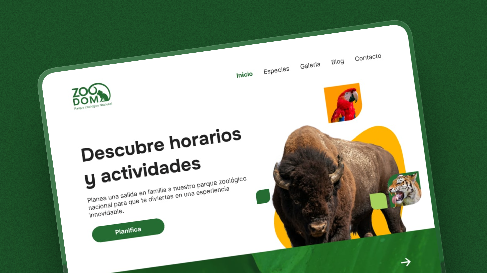

# ZOODOM

Proyecto de diseño y desarrollo de un sitio en producción con **Astro + HTML/CSS/JS + Bootstrap** que busca mejorar **usabilidad, accesibilidad y visibilidad orgánica**.  

El sitio integrará como secciones prioritarias:
- **Fichas de especies**: catálogo interactivo con información científica y multimedia.
- **Calendario de eventos**: actividades, talleres y visitas guiadas.
- **Planifica tu visita**: horarios, tarifas, mapa interactivo y accesibilidad.
- **Blog educativo**: artículos sobre conservación y biodiversidad.
- **Recursos multimedia**: galerías de fotos, videos y material descargable.

---

## Instalación

Clona el repositorio y crea el proyecto Astro:

```sh
npm create astro@latest -- --template basics
```
Instala dependencias:

```sh
npm install
```

## Estructura del proyecto

```text
/
├── public/
│   └── favicon.svg
├── src
│   ├── assets/
│   │   └── astro.svg
│   ├── components/
│   │   └── Welcome.astro
│   ├── layouts/
│   │   └── Layout.astro
│   └── pages/
│       └── index.astro
└── package.json
```
Más información en la guía oficial de Astro sobre estructura de proyectos (docs.astro.build in Bing).

## Objetivos clave

- **Usabilidad**: navegación clara, diseño responsive con Bootstrap.
- **Accesibilidad**: etiquetas ARIA, contraste adecuado, soporte multilenguaje.
- **SEO**: URLs semánticas, metadatos optimizados, sitemap.
- **Educación y conservación**: contenido atractivo y multimedia para sensibilizar al público.

## Despliegue
El sitio puede desplegarse fácilmente en plataformas como:

- **Vercel**
- **Netlify**
- **GitHub Pages**

Ejemplo de despliegue en Vercel:

```sh
npm run build
vercel deploy
```

